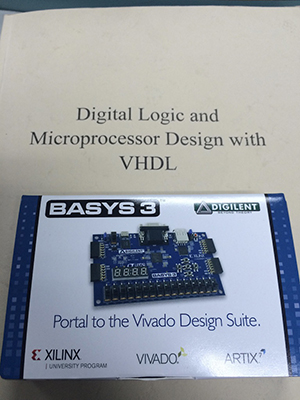
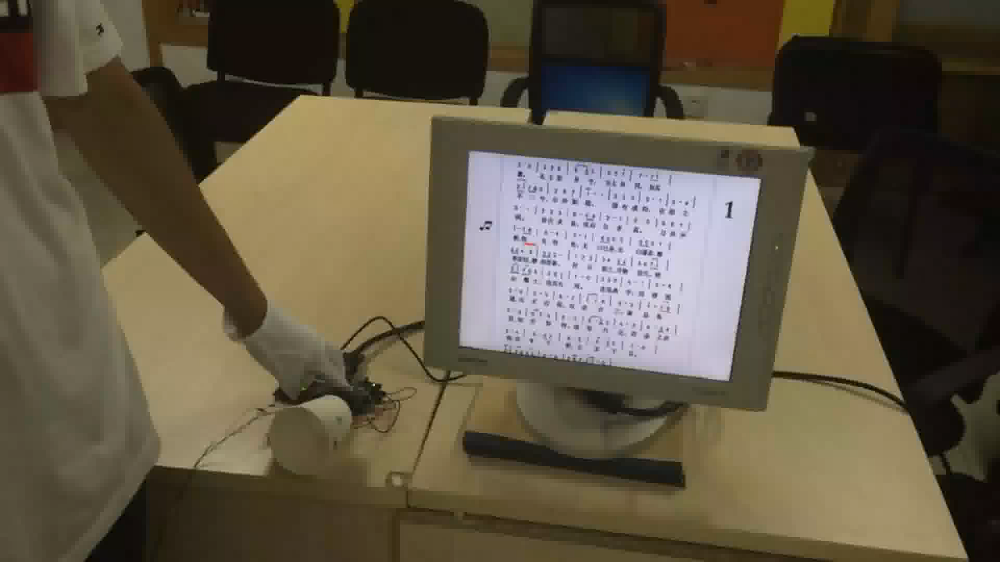

# Projects based on basys3

* Author: LIN JIANING
* Date: 2016.6
* Course: Digital System Design
* Hardware: basys3(a FPGA board with Artix-7)

* Language: Verilog
* IDE: Vivado
* Description: These are project files for the course. Lab6/7/8 are basic projects and `finalproject` is the ultimate project we did during the course. In the final project, we build a system based on FPGA, to control the process of playing a song using human's gestures. It performs like a conductor at the concert.

* Results:

